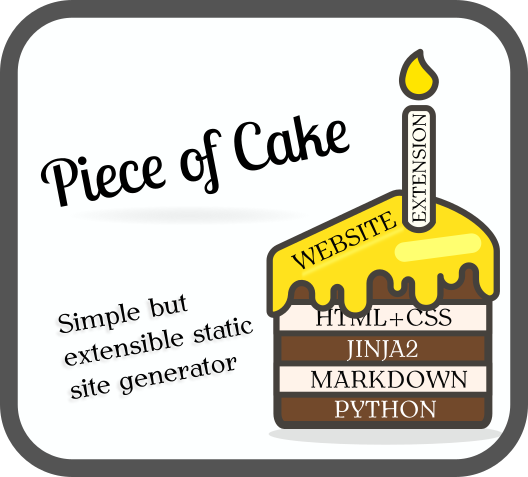
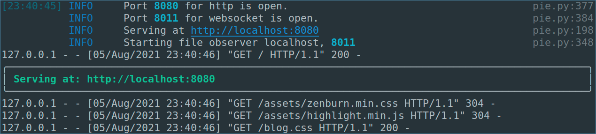

<p align="center">
    
</p>


## Features:

- [x] Live reload
- [x] Http server
- [x] File observer
- [x] Menu 
- [x] Tags
- [x] Extensions
- [x] Most recent
- [x] Markdown parsing
- [x] Extensions
- [x] Convert blog to template.
- [x] Add command that generates the example website. Maybe something like `pie create website`.
- [x] The same for adding markdown file. Maybe something like: `pie create page`.
- [ ] Conflicts (i.e. two sites with the same url)
- [ ] Draft option

## Execution

To execute demo:
```shell 
python pie.py serve -c blog/blog.yaml
```


After successfull execution of serve you should see screen similar to bylow:



## Configuration
The website configuration should be written in YAML language and contain following elements:
* `ROOT_FOLDER`
* `PUBLIC_FOLDER`
* `BASE_URL`

Additionally of any folder (such as css styles or javascript file) should be copied to public folder then it should be specified in `includes` array.

Any additional extensions should be defined in `extensions` array.

### Example configuration:
```yaml
# where markdown files and templates are stored
ROOT_FOLDER: blog
# where website is generated, preferable /tmp and absolute path
PUBLIC_FOLDER: blog_public
# the URL used for deploy
BASE_URL: superblog.com
# the protocol http:// or https://
PROTOCOL: http://

# Folders that should be copied to public folder
includes:
    - assets
    - blog.css
    - blog.rtl.css

# Extensions
extensions:
    - menu
    - tags
    - pagelist
    - search
    - mostrecent
```

## Extensions
Most of the parts of this engine is written as extension. 


